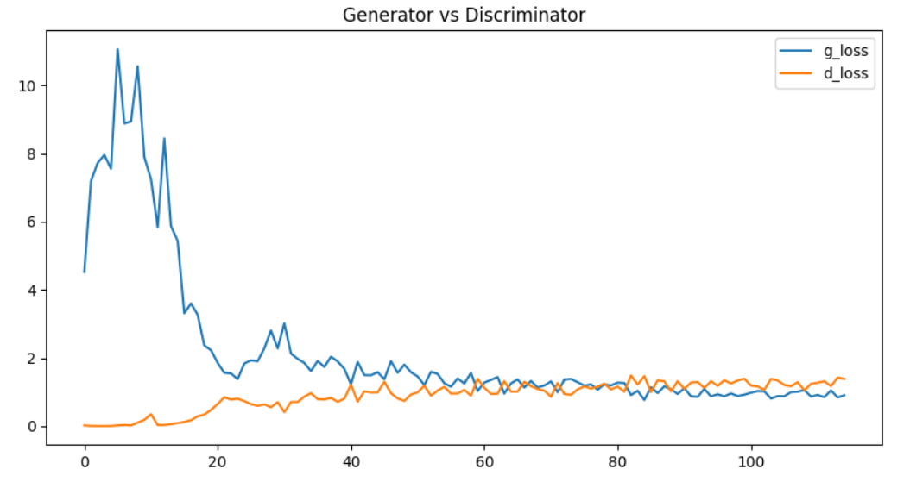
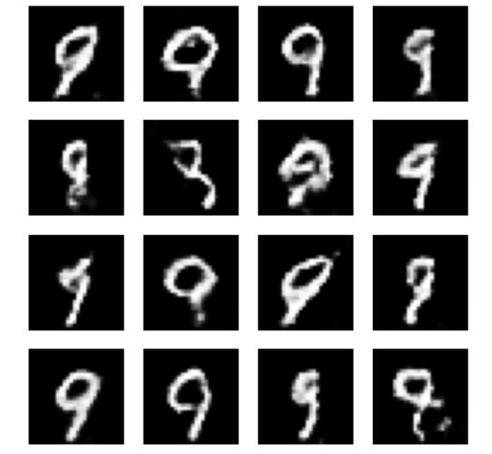
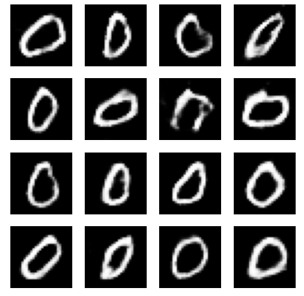

# Conditional GAN (cGAN)

This is a simple implementation of a Conditional Generative Adversarial Network (cGAN) using TensorFlow. The model is trained to generate MNIST digits conditioned on class labels.

## Overview

- **Goal:** Generate handwritten digit images (0–9) based on a given label.
- **Dataset:** [MNIST](http://yann.lecun.com/exdb/mnist/)
- **Model:** Conditional GAN (Generator + Discriminator with label conditioning)
- **Framework:** TensorFlow / Keras

## How It Works

1. The generator takes a random noise vector and a digit label, and generates a fake image corresponding to that digit.
2. The discriminator receives an image and its label, and tries to classify it as real or fake.
3. Both networks are trained simultaneously in a zero-sum game until the generator produces convincing digit images.

## Features

- Embeds class labels into both the generator and discriminator
- Uses binary cross-entropy loss and label conditioning
- Visualizes generated outputs per digit class during training

## Learning Curve

*Generator vs Discriminator loss over training epochs:*

## Sample Results

### Generated Samples for Digit 9

### Generated Samples for Digit 0
> These results were generated after training the model for over 500 epochs, which helped improve the quality for harder digits like 0.

## Notes

- This project is intended for educational purposes.
- The implementation is kept simple and easy to follow.
